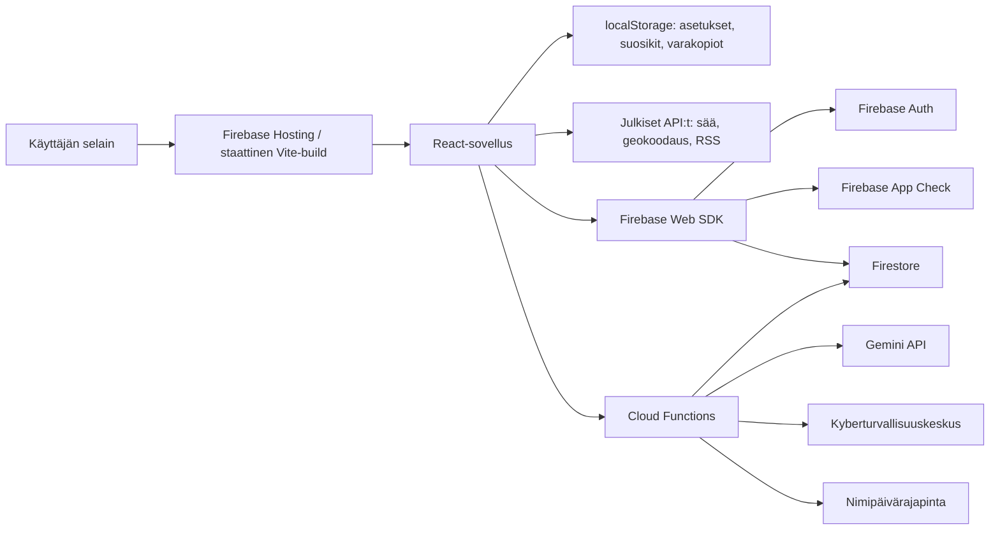

# Aloitussivun nykyarkkitehtuuri asiantuntijalle

Päiväys: 14.6.2026  
Kohde: `Aloitussivu`-repositorio  
Tila: nykyisen toteutuksen kuvaus, ei tavoitearkkitehtuuri

## 1. Tiivistelmä

Aloitussivu on Vite- ja React-pohjainen staattinen verkkosovellus, jonka päätarkoitus on tarjota ikäihmisille selkeä aloitusnäkymä tärkeisiin palveluihin, alueellisiin linkkeihin, uutisiin, säähän, huijausvaroituksiin ja tukitoimintoihin.

Sovellus rakentuu kolmesta pääosasta:

1. Selainkäyttöliittymä, joka tuotetaan Viten staattiseksi `dist`-julkaisuksi.
2. Firebase-palvelut, joita käytetään kirjautumiseen, palautteisiin, linkki-ilmoituksiin, hyväksyttyihin linkkeihin, estettyihin linkkeihin, huijausvaroituksiin ja käyttötilastoihin.
3. Firebase Cloud Functions -taustatoiminnot, jotka välittävät Gemini-tekoälypyyntöjä, keräävät karkeaa käyttötilastoa, hakevat Kyberturvallisuuskeskuksen varoituksia sekä tarjoavat nimipäivätietoa.

Arkkitehtuuri on käytännössä "staattinen frontend + kevyt serverless-tausta". Pääosa sisällöstä on TypeScript-tiedostoihin pakattua dataa. Osa ylläpidettävästä ja käyttäjien tuottamasta tiedosta sijaitsee Firestoressa, mutta sovellus toimii osin myös ilman Firebase-yhteyttä selaimen `localStorage`-varmistuksilla.

## 2. Teknologiapino

### Käyttöliittymä

- React 19
- TypeScript
- Vite 6
- Tailwind CSS
- PostCSS ja Autoprefixer
- Selainrajapinnat: `localStorage`, `navigator.geolocation`, Web Speech API, `fetch`, `FileReader`

### Taustapalvelut

- Firebase Hosting
- Firebase Authentication, Google-kirjautuminen ylläpidolle
- Firebase App Check, reCAPTCHA v3
- Firestore
- Firebase Cloud Functions v2
- Firebase Admin SDK
- Google GenAI SDK

### Ulkoiset julkiset rajapinnat ja lähteet

- Open-Meteo: sää ja geokoodaus
- OpenStreetMap Nominatim: koordinaattien käänteinen geokoodaus
- RSS-syötteet ja kuntien uutis-/RSS-sivut
- rss2json.com ja allorigins.win selaimen CORS-varavaihtoehtoina uutisille
- Kyberturvallisuuskeskuksen RSS-syöte ja sivut
- nimipaivarajapinta.fi
- Gemini API Cloud Function -välityksen kautta

## 3. Julkaisumalli

Sovellus rakennetaan komennolla `npm run build`. Ennen Vite-rakennusta ajetaan `prebuild`, joka päivittää generoituja datatiedostoja:

- `scripts/update-newspapers.mjs`
- `scripts/update-newspaper-feeds.mjs`
- `scripts/update-links.mjs`
- `scripts/update-changelog.mjs`

Vite rakentaa useita HTML-entrypointteja samaan `dist`-hakemistoon. Firebase Hosting julkaisee `dist`-hakemiston.

Nykyiset entrypointit:

| Entry | Tiedosto | Tarkoitus |
| --- | --- | --- |
| `main` | `index.html` + `index.tsx` + `App.tsx` | Etusivu |
| `changelog` | `muutosloki.html` + `muutosloki.tsx` | Muutosloki |
| `suggestions` | `ehdotukset.html` + `ehdotukset.tsx` | Ylläpidon kirjautuminen, palautteet, linkki-ilmoitukset, käyttötilastot ja huijausvaroitukset |
| `feedbackQueue` | `kehitysjono.html` + `kehitysjono.tsx` | Julkinen kehitysjono/palautteet |
| `links` | `linkit.html` + `linkit.tsx` | Linkkiluettelot |
| `admin` | `yllapito.html` + `yllapito.tsx` | Ylläpidon koontisivu |
| `supporters` | `sivua-tukemassa.html` + `sivuaTukemassa.tsx` | Tukijat |
| `privacy` | `tietosuoja.html` + `tietosuoja.tsx` | Tietosuojasivu |
| `accessibility` | `saavutettavuus.html` + `saavutettavuus.tsx` | Saavutettavuusseloste |

Firebase Hostingissä kaikki polut uudelleenkirjoitetaan `index.html`-tiedostoon. Koska Vite tuottaa myös useita HTML-sivuja, asiantuntijan kannattaa tarkistaa, vastaako rewrite-sääntö lopullista julkaisutarvetta kaikissa alisivuissa.

## 4. Korkean tason komponenttikuva

## 5. Käyttöliittymän rakenne

### Etusivu

Etusivun pääkomponentti on `App.tsx`. Se kokoaa näkymän useista komponenteista:

- `Clock`: kello ja aikavyöhyke
- `WeatherCard`: sää, sijainti ja kunnan tunnistus
- `SearchBar`: Google-haku ja puhesyöttö
- `QuickLinks`: valtakunnalliset ja yleiset linkkikategoriat
- `RegionalServicesPanel`: kunta- ja aluekohtaiset linkit
- `ScamAlertsBanner`: huijausvaroitukset
- `Assistant`: tekoälyavustaja
- `FavoriteLinks`: käyttäjän suosikkilinkit
- `InfoModal`, `HomepageModal`, `OnboardingTour`: ohjeistus ja perehdytys
- `FeedbackModal`: yleinen palaute
- `LinkReportModal`: linkki-ilmoitukset
- `FloatingControls`: kelluvat toiminnot ja asetukset

Etusivulla ylläpidetään selaimessa useita käyttäjäkohtaisia asetuksia:

- teema
- tumma/vaalea tila
- käyttöliittymän skaalaus
- kellotyyppi
- lisäaikavyöhyke
- valittu kunta
- suosikit
- näkyvien osioiden valinnat
- perehdytyksen tila
- käyttötilastoinnin poiskytkentä paikallisesti

Tietoja säilytetään pääosin `localStorage`-avaimissa.

### Linkkikategoriat

Yleiset linkit ovat `constants.tsx`-tiedoston `SHORTCUTS`-rakenteessa. Linkit ovat `Shortcut`- ja `Provider`-rakenteita:

- `Shortcut`: kategoria tai suora linkki
- `Provider`: yksittäinen linkki, puhelinlinkki tai palveluntarjoaja

`QuickLinks` suodattaa linkkejä näkyvyyssääntöjen kautta, ryhmittelee niitä käyttäjäystävällisiin vyöhykkeisiin ja tarjoaa hakutoiminnon. Käyttäjä voi lisätä linkkejä suosikkeihin paikallisesti.

### Alueelliset palvelut

Alueelliset palvelut rakentuvat `localServices.ts`-moduulissa. Se yhdistää useita datalähteitä:

- kuntarekisteri
- kuntien verkkosivut
- kuntien kieliversiot
- hyvinvointialueet
- kirjastojärjestelmät
- paikallislehdet
- RSS-syötteet
- palveluliikenne
- kaupunkiliikenne ja reittioppaat
- Kela-taksit
- paikalliset urheiluseurat
- valtakunnallisten linkkikategorioiden alueellisesti sopivat museot, teatterit ja yhdistykset

Käyttäjä voi antaa kunnan manuaalisesti. `RegionalServicesPanel` ratkaisee tekstistä kunnan, hakee siihen liittyvät palvelut ja näyttää tärkeimmät linkit. Isompia alueellisia linkkimääriä näytetään kategoriakohtaisina avauksina.

### Paikalliset uutiset

Paikallisuutiset haetaan selainpuolella `services/rssService.ts`-moduulilla. Hakujärjestys on:

1. suora RSS/Atom-haku
2. rss2json-varahaku
3. HTML-sivun haku allorigins-välityksen kautta ja uutislinkkien poiminta

Yksi rikkinäinen syöte ei estä muiden syötteiden näyttämistä.

### Sää ja sijainti

`WeatherCard` käyttää selaimen sijaintia, Open-Meteo-säätä ja Nominatim-käänteisgeokoodausta. Jos sijaintia ei saada tai se ei ole Suomessa, käytetään vararatkaisua. Kunnan tunnistusta käytetään myös alueellisten linkkien kohdentamiseen.

### Tekoälyavustaja

Selain ei kutsu Geminiä suoraan. `services/geminiService.ts` kutsuu `geminiChat` Cloud Functionia ja liittää pyyntöön App Check -tunnisteen, jos se on saatavilla. Taustatoiminto lisää järjestelmäohjeen, rajaa tehtävätyypit ja välittää pyynnön Gemini API:lle.

### Huijausvaroitukset

Huijausvaroitukset ovat yhdistelmä:

- paikallista `scamAlerts.ts`-dataa
- Firestoresta luettavia `scamAlerts`-tietueita
- Cloud Functionilla päivitettäviä Kyberturvallisuuskeskuksen havaintoja

`ScamAlertsBanner` näyttää voimassa olevat varoitukset, avaa laajemman modaalin ja tarjoaa linkin alkuperäiseen varoitukseen tai lisätietoihin.

## 6. Data ja tiedon lähteet

### Staattiset datamoduulit

Merkittävä osa sovelluksen tiedosta on TypeScript-tiedostoissa:

- `constants.tsx`: valtakunnalliset linkkikategoriat
- `communityLinks.ts`: yhteisö- ja aluelinkkejä
- `municipalRegistry.ts`: kunnat ja hyvinvointialuekytkökset
- `municipalityWebsites.ts`: kuntien verkkosivut
- `municipalityWebsiteLocales.ts`: kuntasivujen kieliversiot
- `localServices.ts`: alueellisten palveluiden yhdistelylogiikka
- `localServiceTransportLinks.ts`: palveluliikenne
- `localNewspaperLinks.ts`: paikallislehdet
- `localNewspaperFeeds.ts`: RSS-syötteet
- `localKelaTaxiNumbers.ts`: Kela-taksien puhelinnumerot
- `localSportsClubs.ts`: urheiluseurat
- `seniorSurfGuidancePlaces.ts`: SeniorSurf-opastuspaikat
- `scamAlerts.ts`: paikalliset huijausvaroitukset
- `changelogData.ts`: muutosloki
- `linkHealth.ts`: build-aikaisesti estettävät linkit

### Generoidut tiedostot

Buildin alussa ajettavat skriptit päivittävät osan tiedostoista dokumentaatiosta ja tarkistuslistoista. Tämä tekee repositoriosta osittain lähdekoodin ja osittain datajulkaisun yhdistelmän.

Keskeiset skriptit:

- `scripts/update-links.mjs`: linkkidatan ja estolistan päivitys
- `scripts/update-newspapers.mjs`: paikallislehtilinkkien päivitys
- `scripts/update-newspaper-feeds.mjs`: RSS-syötteiden päivitys
- `scripts/update-changelog.mjs`: muutoslokidatan päivitys
- `scripts/check-no-hardcoded-secrets.mjs`: kovakoodattujen salaisuuksien tarkistus

### Firestore-kokoelmat

Nykyisten sääntöjen ja koodin perusteella Firestore-kokoelmat ovat:

| Kokoelma | Käyttötarkoitus | Julkinen luku | Julkinen kirjoitus | Ylläpito |
| --- | --- | --- | --- | --- |
| `feedbackItems` | Palautteet ja kehitysjono | kyllä | rajoitettu luonti | päivitys/poisto |
| `feedbackAttachments` | Palautteen kuvakaappausliitteet | ei | rajoitettu luonti | luku/päivitys/poisto |
| `linkReports` | Linkki-ilmoitukset | ei | rajoitettu luonti | luku/päivitys/poisto |
| `approvedLinks` | Ylläpidossa hyväksytyt lisälinkit | kyllä | ei | luonti/päivitys/poisto |
| `blockedLinks` | Runtime-estetyt linkit | kyllä | ei | luonti/päivitys/poisto |
| `scamAlerts` | Huijausvaroitukset | kyllä | ei | luonti/päivitys/poisto |
| `ncscScrapeLog` | Kyberturvallisuuskeskuksen haun loki | vain ylläpito | ei | kirjoitus vain taustalla |
| `adminStats` | Ylläpidon tilastot, kuten nimipäivä-API:n käyttö | vain ylläpito | ei | kirjoitus taustalla |
| `usageStats` | Karkeat käyttötilastot | vain ylläpito | ei | kirjoitus taustalla |

## 7. Ylläpidon ja käyttäjän tietovirrat

### Palautteen jättäminen

1. Käyttäjä avaa palautemodaalin.
2. Selain kerää palautteen aiheen, kuvauksen, sivun, laitteen ja selaimen perustiedot.
3. Käyttäjä voi liittää pienen kuvakaappauksen.
4. `feedback.ts` yrittää tallentaa tiedon Firestoreen.
5. Jos Firestore epäonnistuu, palaute tallennetaan selaimen `localStorage`-varastoon.
6. Ylläpito käsittelee palautteen ylläpitonäkymässä.

### Linkki-ilmoitus

1. Käyttäjä ilmoittaa puuttuvan, rikkinäisen tai väärän linkin.
2. URL normalisoidaan ja hyväksytään vain HTTPS-muodossa.
3. Ilmoitus tallennetaan Firestoreen kokoelmaan `linkReports`.
4. Jos Firebase ei ole käytössä, ilmoitus tallennetaan paikallisesti.
5. Ylläpito hyväksyy, hylkää tai käyttää ilmoitusta estolistan tai hyväksyttyjen linkkien päivitykseen.

### Linkin näkyvyys

Linkin näkyvyys määräytyy useasta lähteestä:

1. Build-aikainen `BLOCKED_LINK_URLS` tiedostossa `linkHealth.ts`.
2. Selaimen `localStorage`-estolista.
3. Firestore-kokoelma `blockedLinks`.
4. `filterVisibleProviders` ja `filterVisibleShortcuts` poistavat estolistan linkit käyttöliittymästä.

Hyväksytyt uudet linkit luetaan `approvedLinks`-kokoelmasta ja yhdistetään olemassa oleviin kategorioihin selaimessa.

### Käyttötilasto

1. `usageTracking.ts` asentaa sivun avauksen ja linkkiklikkausten seurannan.
2. Seuranta ei lähde paikallisesta kehitysympäristöstä eikä selaimesta, jossa käyttäjä on kytkenyt seurannan pois.
3. Pyyntö lähetetään `trackUsage` Cloud Functionille.
4. Function vaatii App Check -tunnisteen.
5. Function tallentaa päiväkohtaiset laskurit Firestoreen `usageStats`-kokoelmaan.

Tilasto on aggregoitu laskuritasolle. Koodi ei tallenna käyttäjän henkilötietoja käyttötilastoon, mutta linkin URL, linkin teksti, kategoria ja sivu tallennetaan.

### Huijausvaroitusten päivitys

1. Ajastettu `ncscWeeklyScrape` ajaa arkipäivisin Kyberturvallisuuskeskuksen haun.
2. Ylläpito voi ajaa haun myös käsin `ncscScrapeNow`-funktiolla.
3. Käsiajo vaatii Firebase ID tokenin ja ylläpitäjän sähköpostin tai UID:n.
4. Haku lukee Kyberturvallisuuskeskuksen RSS-syötettä ja sivuja.
5. Tulos tallennetaan Firestoreen ja näytetään etusivun huijausvaroituksissa.

## 8. Tietoturva- ja yksityisyyskontrollit

### Frontend ja Hosting

Firebase Hosting asettaa seuraavia suojausotsakkeita:

- HSTS
- X-Frame-Options
- X-Content-Type-Options
- Referrer-Policy
- Permissions-Policy
- Content-Security-Policy

CSP rajaa skriptit omaan alkuperään, kuvat omaan alkuperään, data-URI:hin ja seniorsurf.fi:hin, sekä yhteydet Firebaseen, Cloud Functioneihin ja nimettyihin ulkoisiin rajapintoihin.

### Firebase

- Ylläpitäjä tunnistetaan Google-kirjautumisella.
- Ylläpitäjän sähköpostit ovat frontendissä `firebaseClient.ts`-tiedostossa ja Firestore-säännöissä.
- Firestore-säännöt rajaavat julkiset kirjoitukset tarkasti muotoon ja kenttälistaan.
- App Check suojaa Cloud Function -kutsuja Gemini- ja käyttötilastointivirroissa.
- Cloud Functioneissa on muistissa toimiva IP-pohjainen rate limit.

### Palautteet ja liitteet

Palautteessa sallitaan rajattu kenttäjoukko. Kuvakaappausliitteellä on:

- sallittu MIME-tyyppi
- enimmäiskoko
- enimmäispituus data URL -merkkijonolle

Nykyinen liitemalli tallentaa kuvakaappauksen Firestore-dokumenttiin data URL -muodossa. Tämä on yksinkertainen, mutta pidemmällä aikavälillä Firebase Storage olisi parempi paikka kuville.

### Linkki-ilmoitukset

Linkki-ilmoituksissa sallitaan vain HTTPS-URL. Tämä estää osan kevyistä väärinkäyttötapauksista ja vähentää riskiä, että ylläpitoprosessiin päätyy selvästi epäluotettavia osoitteita.

## 9. Ympäristömuuttujat ja salaisuudet

Frontend käyttää vain `VITE_*`-muuttujia:

- `VITE_FIREBASE_API_KEY`
- `VITE_FIREBASE_AUTH_DOMAIN`
- `VITE_FIREBASE_PROJECT_ID`
- `VITE_FIREBASE_STORAGE_BUCKET`
- `VITE_FIREBASE_MESSAGING_SENDER_ID`
- `VITE_FIREBASE_APP_ID`
- `VITE_FIREBASE_APPCHECK_SITE_KEY`
- `VITE_GEMINI_CHAT_URL`
- `VITE_USAGE_TRACK_URL`

Cloud Functions käyttää palvelinpuolen muuttujia:

- `GEMINI_API_KEY`
- `NAMEDAY_API_TOKEN`
- `ADMIN_UIDS`
- `ALLOWED_ORIGINS` tai `ALLOWED_ORIGIN`

Salaisia avaimia ei tule sijoittaa `.env.local`-tiedostoon ilman `VITE_`-rajausta, koska Viten frontend-muuttujat päätyvät selaimeen.

## 10. Saavutettavuuden ja seniorikäytettävyyden arkkitehtuuri

Sovellus on rakennettu seniorikäyttöä ajatellen:

- suuret painikkeet ja linkit
- säädettävä käyttöliittymän skaalaus
- tumma/vaalea tila
- teemavärit
- puhesyöttö hakuun
- näppäimistöllä suljettavat modaalit
- `aria-label`- ja `sr-only`-merkintöjä
- fokuksen siirtäminen modaalien sulkunappeihin
- alueelliset linkit kohdistuvat valittuun kuntaan

Saavutettavuuden kannalta asiantuntijan kannattaa tarkistaa erityisesti:

- modaalien täydellinen focus trap -käyttäytyminen
- ruudunlukijan ilmoitukset dynaamisissa osioissa
- kontrastit kaikissa teemoissa
- käyttöliittymän toiminta 200 % skaalauksella
- CSP:n, ulkoisten syötteiden ja selaimen estojen vaikutus virheilmoituksiin

## 11. Paikalliset vararatkaisut ja offline-tyyppinen käytös

Sovellus ei ole varsinainen offline-sovellus. Siinä on kuitenkin useita "best effort" -varmistuksia:

- palautteet tallentuvat paikallisesti, jos Firestore epäonnistuu
- linkki-ilmoitukset tallentuvat paikallisesti, jos Firebase ei ole käytössä
- hyväksytyt linkit ja estolistat ovat välimuistissa localStoragessa
- suosikit ja käyttäjän asetukset ovat paikallisia
- käyttötilastointi ei saa häiritä käyttäjää, vaikka se epäonnistuisi

Tämä lisää käyttövarmuutta mutta tuo myös arkkitehtuurisen kysymyksen: paikallinen varasto ja pilvivarasto voivat eriytyä toisistaan.

## 12. Arkkitehtuuriset vahvuudet

- Julkaisu on yksinkertainen: staattinen Vite-build ja Firebase Hosting.
- Suurin osa sisällöstä on versionhallinnassa, jolloin muutokset ovat auditoitavia.
- Firestore-säännöissä on tarkka kenttätason validointi julkisille kirjoituksille.
- Gemini-avainta ei paljasteta selaimeen, vaan sitä käytetään Cloud Functionissa.
- App Check on käytössä tärkeissä taustakutsuissa.
- Linkkien näkyvyys on keskitetty `linkVisibility.ts`-moduuliin.
- Alueellinen palvelulogiikka on suhteellisen selvästi yhdessä moduulissa.
- Käyttötilastointi on karkeaa ja voidaan kytkeä pois paikallisesti.

## 13. Arkkitehtuuriset riskit ja velat

### Datan määrä TypeScriptissä

Suuria datamääriä on suoraan TypeScript-moduuleissa. Tämä helpottaa julkaisua, mutta voi kasvattaa bundlea ja tehdä datan ylläpidosta koodin ylläpitoa.

Suositus: erottele pidemmällä aikavälillä staattinen data JSON-/CSV-lähteiksi ja rakenna niistä typed data build-vaiheessa.

### Runtime- ja build-aikaisen linkkidatan sekoittuminen

Linkkejä hallitaan sekä koodissa, generoiduissa tiedostoissa, Firestoressa että localStoragessa. Tämä on joustava mutta voi aiheuttaa epäselvyyttä siitä, mikä on "totuus".

Suositus: määrittele yksi ensisijainen linkkirekisteri ja sen päälle auditointi-, hyväksyntä- ja julkaisuprosessi.

### Palauteliitteet Firestoressa

Kuvakaappaukset tallennetaan data URL -muodossa Firestoreen. Tämä sopii pieniin kuviin, mutta ei ole paras pitkäaikainen ratkaisu.

Suositus: siirrä liitteet Firebase Storageen, jos kuvien määrä kasvaa.

### IP-pohjainen rate limit Cloud Functions -muistissa

Rate limit on muistissa oleva `Map`. Se toimii yksittäisessä lämpimässä instanssissa, mutta ei ole hajautettu eikä pysyvä.

Suositus: jos väärinkäyttö kasvaa, siirrä rate limit Firestoreen, Redis-tyyppiseen palveluun tai Cloud Armor -tasolle.

### Ylläpitäjien tunnistus useassa paikassa

Ylläpitäjien sähköpostit ovat sekä frontendissä että Firestore-säännöissä ja osin Cloud Functioneissa.

Suositus: keskitetään ylläpitäjäroolit Firebase custom claims -malliin tai dokumentoituun admin-konfiguraatioon.

### Monisivuinen staattinen sovellus ja Hosting rewrite

Vite rakentaa useita HTML-sivuja, mutta Firebase Hostingin rewrite ohjaa kaikki polut `index.html`-tiedostoon. Tämä voi olla tarkoituksellista SPA-käytöstä, mutta asiantuntijan kannattaa varmistaa alisivujen tuotantokäytös.

### Ulkoisten RSS- ja CORS-välityspalvelujen käyttö selaimessa

Paikallisuutisten hakeminen suoraan selaimesta on helppoa mutta altis CORS- ja palvelun saatavuusongelmille.

Suositus: jos uutisosio on kriittinen, siirrä syötteiden haku Cloud Functioniin ja tarjoa frontendille oma vakaa rajapinta.

## 14. Asiantuntijan tarkistuslista

1. Tarkista Firebase Hostingin rewrite-malli suhteessa monisivuiseen julkaisuun.
2. Tarkista CSP tuotanto-URL:n, Firebase Function -URL:ien ja mahdollisten uusien domainien osalta.
3. Tarkista Firestore-säännöt emulaattoritesteillä erityisesti palautteiden, liitteiden ja linkki-ilmoitusten osalta.
4. Tarkista, riittääkö App Checkin pakollisuus vai pitääkö fallback-käyttäytymistä muuttaa.
5. Tarkista, tallennetaanko palautteen laitteen/selaimen tiedoissa mitään tarpeetonta henkilötietoa.
6. Tarkista käyttötilastoinnin tietosuojaselosteen vastaavuus todelliseen tallennukseen.
7. Tarkista localStorage-varastojen nimet, elinkaari ja mahdollinen tyhjennys-/vientitarve.
8. Tarkista, miten hyväksytyt linkit ja estolinkit siirtyvät pysyvään linkkirekisteriin.
9. Tarkista, miten manuaalinen linkkitarkistus kirjataan ja miten tarkistuksen voimassaolo päättyy.
10. Tarkista Cloud Function -salaisuuksien hallinta Firebase Secret Managerilla.
11. Tarkista saavutettavuus ruudunlukijalla, näppäimistöllä, 200 % skaalauksella ja mobiilissa.
12. Tarkista, että virhetilat ovat käyttäjälle selkeitä, erityisesti Firebase-, RSS-, sijainti- ja AI-toiminnoissa.

## 15. Ehdotettu jatkokehityksen arkkitehtuuripolku

Lyhyellä aikavälillä:

- lukitaan julkaisuosoite ja admin-näkyvyys
- testataan Firestore-säännöt emulaattorilla
- selkeytetään linkkirekisterin totuuden lähde
- dokumentoidaan ylläpitoprosessi linkki-ilmoituksille ja palautteille
- varmistetaan, että tietosuoja- ja saavutettavuussivut vastaavat toteutusta

Keskipitkällä aikavälillä:

- erotetaan iso staattinen linkki- ja kuntadata build-aikaisiksi JSON-lähteiksi
- siirretään uutissyötteiden haku taustalle
- siirretään kuvakaappausliitteet Firebase Storageen
- keskitetään admin-roolit custom claimseihin
- lisätään automaattiset Firestore-rules-testit

Pitkällä aikavälillä:

- rakennetaan varsinainen linkkien hallintamalli, jossa jokaisella linkillä on lähde, tarkistuspäivä, tarkistaja, riskiluokka ja voimassaolo
- erotetaan sisältö, linkkirekisteri ja sovelluskoodi toisistaan selkeämmin
- otetaan käyttöön hyväksyntäputki ennen linkkien päätymistä julkiseen näkymään

## 16. Tärkeimmät tiedostot

| Tiedosto | Rooli |
| --- | --- |
| `App.tsx` | Etusivun kokoava sovelluslogiikka |
| `components/QuickLinks.tsx` | Yleiset linkit, haku, suosikit |
| `components/RegionalServicesPanel.tsx` | Kuntakohtaiset palvelut |
| `components/FeedbackModal.tsx` | Palautteen lähetys |
| `components/LinkReportModal.tsx` | Linkki-ilmoitukset |
| `components/ScamAlertsBanner.tsx` | Huijausvaroitusten näyttö |
| `firebaseClient.ts` | Firebase Web SDK, Auth, App Check ja admin-tarkistus |
| `feedback.ts` | Palautteiden tallennus ja tilapäinen localStorage-varmistus |
| `linkVisibility.ts` | Linkkien estot, ilmoitukset ja hyväksytyt linkit |
| `approvedLinks.ts` | Ylläpidossa hyväksytyt lisälinkit |
| `usageTracking.ts` | Sivun ja linkkiklikkausten tilastointi |
| `localServices.ts` | Alueellisen datan yhdistely |
| `services/rssService.ts` | Paikallisuutisten haku |
| `services/geminiService.ts` | Frontendin AI-kutsut |
| `functions/gemini.ts` | Gemini Cloud Function |
| `functions/usage.ts` | Käyttötilastojen Cloud Function |
| `functions/ncscCron.ts` | Kyberturvallisuuskeskuksen ajastettu ja käsin ajettava haku |
| `functions/nameday.ts` | Nimipäivärajapinta |
| `firestore.rules` | Firestore-tietoturvasäännöt |
| `firebase.json` | Hosting-, headers-, functions- ja rules-konfiguraatio |
| `vite.config.ts` | Vite-build ja monisivuiset entrypointit |

